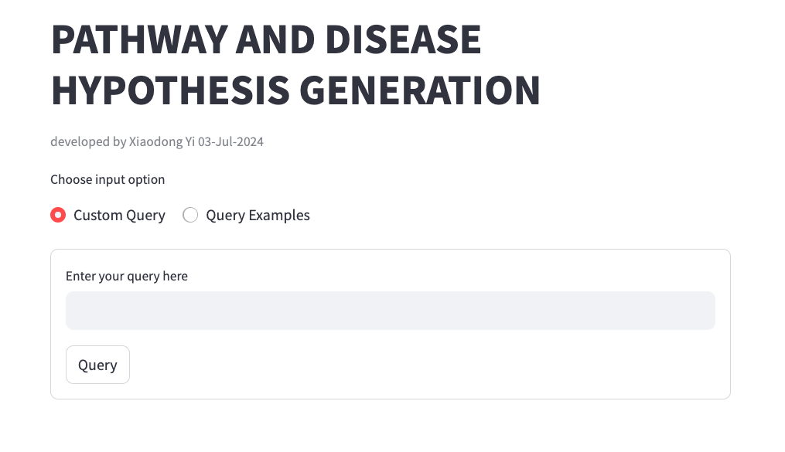
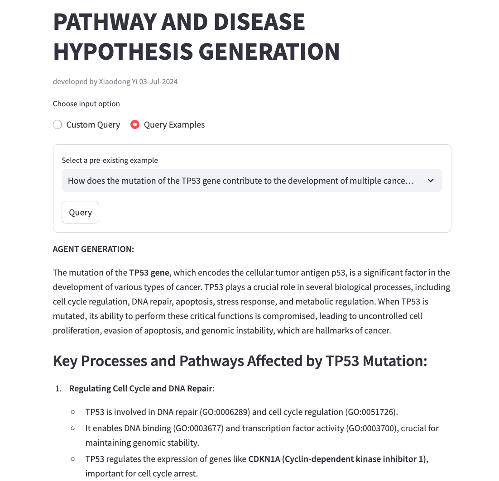
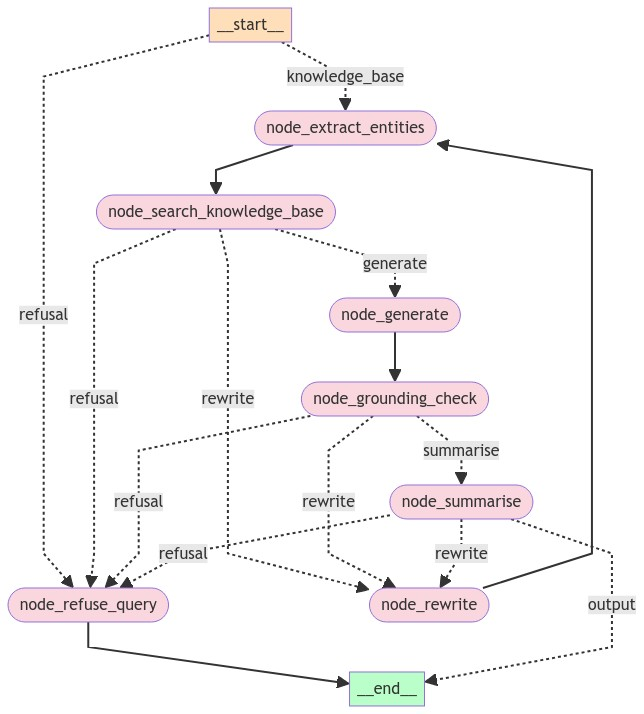

# PATHWAY AND DISEASE HYPOTHESIS GENERATION

## OBJECTIVES

A LLM-powered agentic app has been developed for generating hypotheses about the roles of specific genes in diseases, utilizing structured information from KEGG and Gene Ontology (GO).

## QUICK START

- 1. Prepare Python Environment

    Install lated python interpreter or using environment management tool such as 'miniconda' and execute `conda create -n causaly python` and `conda activate causaly` to activate the environment.

- 2. Clone the repo
    `git clone https://github.com/YiSays/causaly.git`

- 3. Install dependencies

    Instal required dependencies and libraries.
    `pip install -r requirements.ext`

- 4. Config OpenAI API key
    open the `.env.example` file, and paste your own key right after 'OPENAI_API_KEY=', and save the file. Lastly, change the file name from `.env.example` to `.env`.

- 5. launch the agent app

    launch the app, and it would automatically re-direct to a browser page.
    `streamlit run app.py`

- 6. Query in the landing page

    
    
    You can input your own query or select some query examples and then click "Query"
    

    > Example queries:
    >
    > - "How does the mutation of the TP53 gene contribute to the development of multiple cancer types?"
    > - "What is the impact of the APOE ε4 allele on Alzheimer's disease progression?"
    > - "In which cellular pathways is the KRAS gene involved, and how do its mutations lead to cancer?"
    > - "Which neurological disorders are linked to mutations in the MECP2 gene?"
    > - "How to bake a cake?"
    
    

    > BTW, more details will be printed out in the backend terminal.

    ```bash
    How does the mutation of the TP53 gene contribute to the development of multiple cancer types?
    {'routing': 'knowledge_base'}
    ---ROUTE QUESTION TO KNOWLEDGE BASE---
    ---EXTRACT ENTITIES---
    ---SEARCH KNOWLEDGE BASE---
    ---ASSESS RETRIEVED CONTEXT---
    ---DECISION: GENERATE BASED ON CONTEXT---
    ---GENERATE ANSWER---
    ---GROUNDING CHECK---
    ---GENERATION IS NOT GROUNDED IN CONTEXT---
    ---FINDINGS HAVE BEEN FILTERED---
    ---ASSESS FILTERED FINDINGS---
    ---DECISION: NO SOLID FINDINGS, REWRITE QUERY---
    ---REWRITE QUERY---
    ---EXTRACT ENTITIES---
    ---SEARCH KNOWLEDGE BASE---
    ---ASSESS RETRIEVED CONTEXT---
    ---DECISION: GENERATE BASED ON CONTEXT---
    ---GENERATE ANSWER---
    ---GROUNDING CHECK---
    ---GENERATION IS GROUNDED IN CONTEXT---
    ---GENERATION IS GROUNDED IN CONTEXT---
    ---FINDINGS HAVE BEEN FILTERED---
    ---ASSESS FILTERED FINDINGS---
    ---DECISION: SUMMARISE FINDINGS---
    ---SUMMARISE FINDINGS---
    ---CHECK ANSWER RELEVANCE---
    ---DECISION: OUTPUT ANSWER---
    ```

---

## DEVELOPMENT STEPS

### A. DATA RETRIEVAL:

- **A1. KEGG Pathways**
    - 1. Alzheimer's disease (hsa05010)
    - 2. Parkinson's disease (hsa05012) 
    - 3. Type II diabetes mellitus (hsa04930) 
    - 4. Colorectal cancer (hsa05210)

    These four KEGG KGML XML files are provided with the assignment.

- **A2. Gene Ontology**
    "Gene Ontology Human Annotations" GAF file was downloaded from the [Gene Ontology Website](https://current.geneontology.org/products/pages/downloads.html).

### B. STRUCTURED KNOWLEDGE EXTRACTION:

- **B1. Parse KGML files:**

    A directed graph has been built based on the KGML files, where each node represents an `<entry>` and each edge represents a `<relation>` in the KGML files.

- **B2. Parse GAF file:**

    The GAF file also provides interactions between gene ontology terms, with names and symbol codes.

- **B3. Integrate data:**

    An integrated dataset based on the KGML and GAF files has been created with a three-layer structure: Disease (Pathway) -> Genes (in KEGG) <---> GO terms (in GAF).

### HYPOTHESIS GENERATION AGENT:

An agentic system has been developed capable of taking user queries and generating hypotheses about gene involvement in specific diseases.

- **C1. Develop the agent**

    The agent was developed using langgraph with LLM model 'GPT-4o'. It is capable to extract key entities and conduct a knowledge base search for related bio-science information. Based on the findings, LLM is used to generate potential hypotheses for gene-disease involvement/interaction.

- **C2. Implement downstream analysis**

    It also capable to extract information from GO GAF which provides information for downstream analysis.

This agent also capable with hallucination check, self-query (query re-writing) and answer relevance check. More details are discussed below.



#### The workflow of the agent is described below:

- 1. Receive user query.
- 2. Check if the user query is related to gene involvement investigation.
    - If yes, go to step 3.
    - If no, refuse the query.
- 3. Extract entities (gene, disease, etc.) and search the knowledge graph.
    - If no context can be found:
        - Rewrite the query.
        - Refuse the query if the query has been rewritten.
- 4. Based on the context of each entity, generate hypothesis findings.
- 5. Ground-check if the generation is a hallucination.
    - If all generations are filtered out:
        - Rewrite the query.
        - Refuse the query if the query has been rewritten.
- 6. Summarize the grounded findings.
- 7. Check answer relevance.
    - If the answer solves the query, go to step 9 and output the result.
    - If the answer is not good enough or irrelevant to the query:
        - Rewrite the query.
        - Refuse the query if the query has been rewritten.
- 8. (Optional) Rewrite the query and go back to step 3.
- 9. Output final findings.
- 10. (Optional) Refuse the query and return a refusal output.

## Future Work

- The knowledge search can be improved by implementation of an advanced graph database with Cypher query language, e.g. Neo4j.

- Agent can be upgraded into a multi-agents workflow where multiple agents interact with each other. Each agent is specialized in one task, such as one for gene related queries, one for disease related queries, one for upstream analysis and one for downstream etc.

- Safeguard tools can be introduced into the LLM-based workflow for toxicity detection and privacy masking etc.

---
### Agent response examples:

**Question 1**: "How does a mutation in the TP53 gene lead to the development of various types of cancer?"

**AGENT RESPONSE:** A mutation in the TP53 gene leads to the development of various types of cancer through multiple mechanisms. The TP53 gene encodes the protein p53, which is pivotal in several critical biological processes and cellular functions. Here are the key mechanisms by which TP53 mutations contribute to cancer:

1. **DNA Damage Response**: TP53 is integral to the DNA damage response (GO:0006974, GO:0006977, GO:0006983). It aids in the repair of damaged DNA (GO:0006302). Mutations in TP53 can result in genomic instability, allowing the accumulation of additional mutations that drive cancer progression.

2. **Cell Cycle Regulation**: TP53 plays a crucial role in cell cycle regulation (GO:0051726, GO:1904024, GO:0008285). It can induce cell cycle arrest to facilitate DNA repair or trigger apoptosis if the damage is irreparable. Mutations in TP53 can disrupt these processes, leading to uncontrolled cell proliferation, a hallmark of cancer.

3. **Apoptosis**: TP53 is involved in the regulation of apoptosis (GO:0006914, GO:0006978, GO:0033209, GO:0097193). It can activate pro-apoptotic genes such as BAX (hsa:581) and BAK1 (hsa:578). Mutations in TP53 can inhibit apoptosis, allowing damaged cells to survive and proliferate.

4. **Transcription Regulation**: TP53 functions as a transcription factor (GO:0003700, GO:0001227, GO:0001228, GO:0000978), regulating the expression of genes involved in cell cycle arrest, DNA repair, and apoptosis. Mutations can impair its ability to bind DNA and regulate these critical genes, contributing to cancer development.

5. **Interaction with Other Proteins**: TP53 interacts with various other proteins (GO:0005515, GO:0097718, GO:0042802), including CDKN1A (hsa:1026), DDB2 (hsa:1643), and GADD45G (hsa:10912). These interactions are essential for its tumor suppressor functions, and mutations can disrupt these interactions, further promoting cancer.

6. **Metabolic Regulation**: TP53 also influences cellular metabolism (GO:0008156, GO:0019661). Mutations in TP53 can lead to metabolic changes that support cancer cell growth.

7. **Development and Differentiation**: TP53 is involved in various developmental processes (GO:0001836, GO:0001701, GO:0048568) and cellular differentiation (GO:0030154). Disruption of these processes by TP53 mutations can contribute to tumorigenesis.

In summary, TP53 mutations contribute to cancer by disrupting the DNA damage response, cell cycle regulation, apoptosis, transcriptional regulation, protein interactions, metabolism, and developmental processes. This multifaceted impact underscores the critical role of TP53 in maintaining cellular homeostasis and preventing cancer. Further research is needed to explore the specific pathways and interactions affected by TP53 mutations to develop targeted cancer therapies.

---
**Question 2:** What is the impact of the APOE ε4 allele on Alzheimer's disease progression?

**AGENT RESPONSE:** The APOE ε4 allele has a significant impact on the progression of Alzheimer's disease. The presence of the APOE ε4 allele is associated with an increased risk of developing Alzheimer's disease and can accelerate the progression of the disease. The APOE gene, also known as Apolipoprotein E (hsa:348), is a major genetic factor in Alzheimer's disease, which is detailed in the pathway hsa05010 (Alzheimer disease).

Further research is needed to fully understand the precise mechanisms by which the APOE ε4 allele influences Alzheimer's disease progression. It is hypothesized that the APOE ε4 allele may interact with other genes and proteins involved in the disease, such as Amyloid-beta precursor protein (APP, hsa:351), Presenilin-1 (PSEN1, hsa:5663), and Microtubule-associated protein tau (MAPT, hsa:4137). Additionally, the Wnt signaling pathway (path
) and various other pathways and proteins may play roles in the disease mechanism influenced by the APOE ε4 allele.

In summary, the APOE ε4 allele is a critical factor in Alzheimer's disease, and its presence is associated with a heightened risk and accelerated progression of the disease. Further investigation into the interactions between APOE ε4 and other genetic and protein factors is necessary to fully elucidate its role in Alzheimer's disease progression.

---

**Question 3:** In which cellular pathways is the KRAS gene involved, and how do its mutations lead to cancer?

**AGENT RESPONSE:** The KRAS gene, also known as GTPase KRas, plays a crucial role in various cellular pathways and processes. It is associated with numerous Gene Ontology (GO) terms that highlight its involvement in biological processes, molecular functions, and cellular components.

**Biological Processes:**
- **Cell Proliferation and Growth:** KRAS is involved in the positive regulation of cell proliferation (GO:0008542), regulation of multicellular organism growth (GO:0060252), and homeostasis of the number of cells (GO:0048873).
- **Development and Differentiation:** It plays a role in epithelial tube morphogenesis (GO:0060441), lung development (GO:0060509), skeletal muscle cell differentiation (GO:0035914), striated muscle cell differentiation (GO:0051146), forebrain development (GO:0021897), and gliogenesis (GO:0014009).
- **Signal Transduction:** KRAS is crucial for the MAPK cascade (GO:0000165), Ras protein signal transduction (GO:0007265), and regulation of Rho protein signal transduction (GO:0035022).
- **Cell Cycle and Apoptosis:** It is involved in the negative regulation of cell cycle arrest (GO:0030857), negative regulation of neuron apoptotic process (GO:0043524), and neuron apoptotic process (GO:0051402).
- **Other Processes:** KRAS also contributes to actin cytoskeleton organization (GO:0030036), regulation of neuronal synaptic plasticity (GO:0048169), and regulation of synaptic transmission, GABAergic (GO:0032228).

**Molecular Functions:**
- **Binding Activities:** KRAS has protein binding (GO:0005515), protein kinase binding (GO:0043495), macromolecular complex binding (GO:0044877), GTP binding (GO:0005525), and GDP binding (GO:0019003) activities.
- **Enzymatic Activities:** It exhibits GTPase activity (GO:0003924, GO:0003925).

**Cellular Components:**
- **Membrane Associations:** KRAS is located in the membrane (GO:0016020), cytoplasmic side of the plasma membrane (GO:0009898), endoplasmic reticulum membrane (GO:0005789), plasma membrane (GO:0005886), mitochondrial outer membrane (GO:0005741), and Golgi membrane (GO:0000139).
- **Cytoplasmic Locations:** It is found in the cytosol (GO:0005829), cytoplasm (GO:0005737), and focal adhesion (GO:0005925).

**Impact of KRAS Mutations on Cancer:**
Mutations in the KRAS gene can lead to cancer primarily through the dysregulation of cell proliferation and survival pathways. These mutations often result in the constitutive activation of the Ras protein, leading to continuous cell division and avoidance of programmed cell death (apoptosis). This uncontrolled cell growth is a hallmark of cancer.

**Hypothesis:** The aberrant activation of KRAS due to mutations may result in persistent activation of downstream signaling pathways, such as the MAPK cascade (GO:0000165) and Ras protein signal transduction (GO:0007265), which could promote oncogenic transformation and tumor development.

**Summary:**
The KRAS gene is integral to a wide range of cellular processes and pathways, particularly those related to cell growth, differentiation, and signal transduction. Mutations in KRAS can lead to cancer by causing continuous and unregulated cell proliferation. Further research is needed to fully understand the specific mechanisms by which KRAS mutations contribute to different types of cancer.

---

**Question 4:** Which neurological disorders are linked to mutations in the MECP2 gene?

**AGENT RESPONSE:** Sorry that I can not help with the given query below. The query may be irrelevant or the knowledge base does not contain sufficient information for related entities.

Query: What neurological disorders are associated with mutations in the MECP2 gene?

---

**Question 5:** How to bake a cake?

**AGENT RESPONSE:** Sorry that I can not help with the given query below. The query may be irrelevant or the knowledge base does not contain sufficient information for related entities.

Query: How to bake a cake?

---